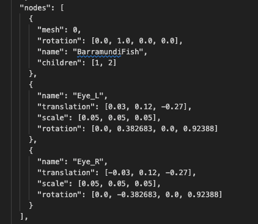

# Three.js + React Three Fiber

POC do uso da biblioteca Three JS + Fiber para renderizar objetos 3D e manipula-los.

Os objetos usados nesse exemplo são propriedades do repositorio [glTF V2.0 Sample Models](https://github.com/KhronosGroup/glTF-Sample-Assets), e foram usados sem fins comerciais.

# Instruções para executar a DEMO

Para rodar basta:

    npm install
    npm run dev

# Instruções para uso

O input do plugin deve seguir o type [ModelType](src/CustomModel.tsx), passando como definições:

- o arquivo .GLTF ou .GLB do modelo principal
- a lista de pontos de referencias (ou ancoras)
- o arquivo que sera colocado nesses pontos de referência

### Busca de modelos via API

Se o arquivo que será usado for carregado via API, o recomendado é que se use .GLB, por ser uma extensão menor e ser contida em apenas um arquivo.

# Arquivo do modelo 3D

O arquivo dos modelos 3D a serem utilizados devem conter algumas configurações para permitir a customização adequada.

### Configurações gerais

Para uma experiencia mais fácil manipulando anexos e redimensionamentos, é imprescindível que o modelo se encontre na origem do espaço (coordenadas 0,0,0)

### Configuração de nodes

Antes de gerar o arquivo .GLB, devem ser definidos os pontos de referencia que serão usados para posicionar os anexos ao modelo principal (ex: maçanetas em um armário).

Cada ponto de referencia deve conter suas próprias definições de escala e rotação, para que quando o modelo do anexo for adicionado ao modelo principal, a composição fique correta.

Deve-se também se atentar que o ponto de referência deve condizer com o ponto de origem do modelo do anexo (ex: se a origem do anexo for no canto inferior direito, o ponto de referencia deve ser o canto inferior direto da posição final desejada).

[Exemplo de definição de nodes em um arquivo .GLTF](public/fish/BarramundiFish.gltf):

### Configuração de malhas

Além dos pontos de referência, deve-se separar as geometrias em grupos de malhas que serão das mesmas cores. Assim é possível ajustar o código que customiza a cor para aplicar a cor apenas as geometrias relevantes.
